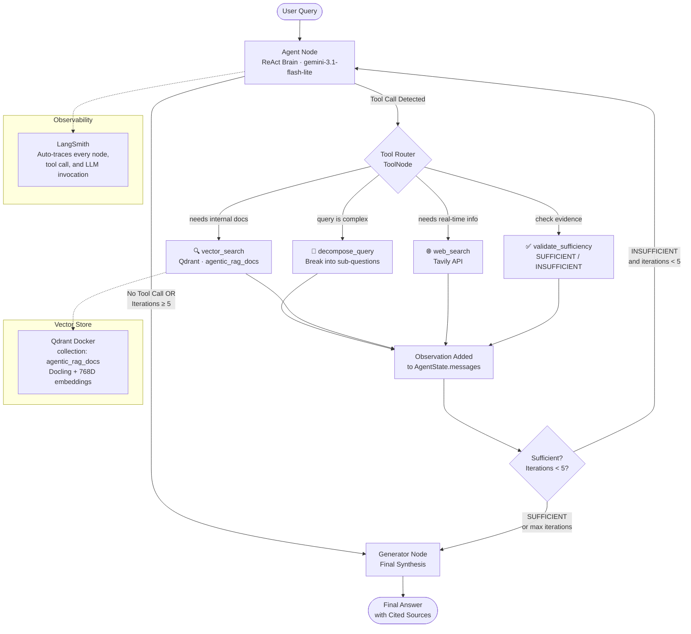

<h1 align="center">Agentic RAG</h1>

<p align="center">
  
  
  
  
  
  
  
</p>

<p align="center">
  An autonomous research agent powered by a <strong>LangGraph ReAct loop</strong>.<br/>
  It dynamically plans, routes, and gathers evidence using external tools before generating an answer.<br/>
  Part of the <a href="https://github.com/rajkumarpawar07/RAG-Architectures"><strong>RAG-Architectures</strong></a> collection.
</p>

---

## 🧭 The Problem This Solves

Traditional RAG assumes the vector database contains the entire answer. But what if the user's question requires synthesizing private docs with real-time news? Or what if the query is so complex it needs to be broken down into three separate searches?

**Agentic RAG** introduces a "Brain". Instead of blindly fetching documents, the LLM enters a **Reason → Act → Observe** loop. It has a toolbelt of capabilities and decides autonomously how to research the user's question before finally synthesizing an answer.

---

## 🛠️ The Agent's Toolbelt

The agent is equipped with four core tools:

1. 🔀 **`decompose_query`**: Breaks complex, multi-part questions into focused sub-questions.
2. 🔍 **`vector_search`**: Queries the internal knowledge base (Qdrant) for proprietary/private documents.
3. 🌐 **`web_search`**: Queries the live internet (Tavily) for real-time news, pricing, or external facts.
4. ✅ **`validate_sufficiency`**: Evaluates all gathered context to determine if it's enough to fully answer the original query without hallucinating.

---

## 🧠 Architecture (ReAct Loop)



---

## 🚀 Setup & Installation

### Prerequisites
- Python 3.9+
- Docker (for Qdrant)
- API Keys: Google Gemini, Tavily, LangSmith

### 1. Start Qdrant
```bash
docker run -d -p 6333:6333 --name qdrant-agentic qdrant/qdrant
```

### 2. Environment Variables
Create a `.env` file in the `Agentic_RAG/` directory:
```env
GOOGLE_API_KEY="..."
TAVILY_API_KEY="..."
LANGSMITH_TRACING="true"
LANGSMITH_API_KEY="..."
LANGSMITH_PROJECT="AgenticRAG"
QDRANT_URL="http://localhost:6333"
QDRANT_COLLECTION="agentic_rag_docs"
```

### 3. Install Dependencies
```bash
pip install -r requirements.txt
```

---

## 💻 Usage

This module comes with a beautiful Typer CLI and a Rich-powered interactive REPL that lets you watch the agent's inner monologue stream in real time.

### Ingest Documents
Parse your PDFs with `Docling`, chunk them, and upload to Qdrant:
```bash
python main.py ingest
```

### Interactive Agentic Chat (REPL)
Start a live research session. Watch the agent plan and use tools:
```bash
python main.py chat
```

### Single One-Shot Query
```bash
python main.py query "Based on our internal documents and today's news, what is the strategy?"
```

### View System Stats
```bash
python main.py stats
```

---

## 📊 Observability with LangSmith

Because this pipeline uses LangGraph, LangSmith observability is **automatic**. 
Head over to your LangSmith dashboard to see:
- Visualized execution graphs
- The exact time spent in the `AgentNode` vs `Tools`
- Token usage for every reasoning step
- The exact JSON inputs/outputs of every tool call
