# Conversational RAG — Adding Memory

<p align="center">
  
  
  
  
  
</p>

<p align="center">
  A stateful RAG pipeline that remembers chat history and dynamically rewrites queries to solve the "context blindness" problem.<br/>
  Part of the <a href="https://github.com/rajkumarpawar07/RAG-Architectures"><strong>RAG-Architectures</strong></a> collection.
</p>

---

## Why This Exists

In a standard RAG setup, if a user asks a follow-up question like "How much does it cost?", the system fails because it doesn't know what "it" refers to when searching the vector database. 

This architecture introduces **Stateful Memory** (via SQLite) and **Query Rewriting** (via an LLM). The system stores the last 5-10 turns of the conversation, using them alongside the new query to generate a "Stand-alone Query" (e.g., "What is the price of the Enterprise Plan?"). This expanded query is then used for the vector search, providing a natural, human-like chat experience.

---

## Features

**Conversational Memory**
Uses `sqlite3` to store and retrieve the last N conversational turns natively on disk, allowing you to resume sessions via unique Session IDs.

**Query Rewriting**
Employs a zero-temperature LLM generation step to dynamically rewrite vague follow-up questions into fully contextualized, standalone queries before hitting the vector database.

**High-Performance Vector Search**
Powered by **Qdrant**, running locally via Docker, to handle embeddings securely and efficiently with exact cosine similarity matching.

**Fast Ingestion**
Swapped to **PyMuPDF (`fitz`)** for rapid, lightweight PDF text extraction during the ingestion phase.

**Production-Grade Prompt Engineering**
The final generator LLM is fed the *Retrieved Chunks*, the *Standalone Query*, AND the *Conversation History*, ensuring answers are both grounded in source documents and contextually aware of the ongoing chat.

---

## Architecture

```mermaid
flowchart TD
    subgraph Ingestion["📥 Ingestion Pipeline"]
        A["PDF Files (PyMuPDF)"] --> B["Recursive Chunker"]
        B --> C["Gemini Embedder"]
        C --> D[("Qdrant Vector DB")]
    end
    
    subgraph Query["💬 Conversational Query Pipeline"]
        E["User Query"] --> F{"Has History?"}
        
        %% Memory Branch
        F -->|Yes| G["Fetch Last 5 Turns\n(SQLite)"]
        G --> H["Query Rewriter (LLM)"]
        H -->|Generates Standalone Query| I
        
        %% No Memory Branch
        F -->|No| I["Embed Standalone Query"]
        
        %% Retrieval & Generation
        I --> J["Search Qdrant"]
        J --> K["Top-K Chunks"]
        K --> L["Prompt Builder\n(Includes History)"]
        L --> M["Gemini LLM Generator"]
        M --> N["Answer + Sources"]
        
        %% Save to Memory
        N -.->|"Save Q&A Pair"| O[("SQLite Memory DB")]
    end
```



---

## Project Structure

```text
Conversational_RAG/
├── data/                   # 📂 Drop your PDFs here
├── memory.db               # 💾 Auto-created: SQLite DB for chat history
├── config.py               # ⚙️ Central config (models, paths, top-k)
├── document_loader.py      # 📄 Fast text extraction using PyMuPDF
├── chunker.py              # ✂️ Recursive character text splitting
├── embedder.py             # 🧠 Gemini embeddings with batching
├── vector_store.py         # 📦 Qdrant client (Upsert, Search)
├── memory.py               # 🧠 SQLite operations (Save/Get history)
├── query_rewriter.py       # 🔄 LLM logic to rewrite contextual queries
├── generator.py            # 💬 Gemini LLM to generate the final answer
├── rag_pipeline.py         # 🔗 Orchestrates ingestion + conversational flows
├── main.py                 # 🚀 CLI entry point (handles session IDs)
├── requirements.txt        # 📋 Python dependencies
└── .env                    # 🔑 API Keys
```

---

## Getting Started

### Prerequisites

- Python 3.9 or higher
- A Google Gemini API key
- Docker Desktop (to run Qdrant)

### Installation

**1. Run Qdrant Vector Database**
Ensure Docker is running, then start the Qdrant container:
```bash
docker run -p 6333:6333 qdrant/qdrant
```

**2. Install dependencies**
Navigate to the module directory and install the requirements:
```bash
cd RAG-Architectures/Conversational_RAG
pip install -r requirements.txt
```

**3. Configure your API key**
Create a `.env` file in the `Conversational_RAG/` directory:
```env
GOOGLE_API_KEY="your_api_key_here"
```

---

## Usage

### 1. Ingest Documents

Place your `.pdf` or `.txt` files into the `data/` folder, then run:

```bash
python main.py ingest
```
*Parses, chunks, embeds, and upserts all documents into your local Qdrant instance.*

### 2. Interactive Chat (With Memory)

Start a continuous Q&A session. The system will remember your previous questions!

```bash
python main.py chat --session "my_chat_1"
```
*(Type `quit` or `exit` to end the session)*

### 3. Query — Single Question

```bash
python main.py query "Who is Rajkumar Pawar?" --session "my_chat_1"
```

### 4. View Statistics

Check how many vectors have been embedded into Qdrant:

```bash
python main.py stats
```

---

## Configuration (`config.py`)

Easily tune the pipeline parameters:

- **`MEMORY_WINDOW`**: Change the number of past Q&A turns the system remembers (Default is 5).
- **Qdrant**: Modify `QDRANT_URL` and `QDRANT_COLLECTION`.
- **Models**: Swap the LLM model (`gemini-3.1-flash-lite`, `gemini-2.5-flash`, etc.).

---

## Part of RAG-Architectures

This module builds upon the Standard RAG pipeline by introducing conversational state and query rewriting.

```text
RAG-Architectures/
├── Standard_RAG/
├── Conversational_RAG/  ◀ You are here
├── HyDE_RAG/
├── Corrective_RAG/
├── Agentic_RAG/
├── Graph_RAG/
└── Hybrid_RAG/
```

🔗 [View the full collection →](https://github.com/rajkumarpawar07/RAG-Architectures)
