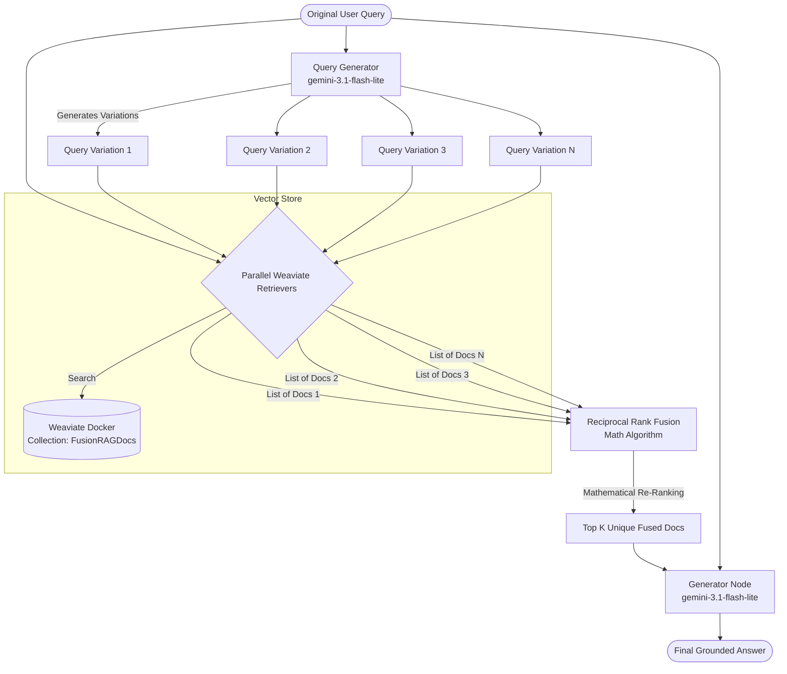

<h1 align="center">Fusion RAG</h1>

<p align="center">
  
  
  
  
  
  
</p>

<p align="center">
  A high-recall RAG pipeline using <strong>Query Expansion</strong> and <strong>Reciprocal Rank Fusion (RRF)</strong>.<br/>
  Part of the <a href="https://github.com/rajkumarpawar07/RAG-Architectures"><strong>RAG-Architectures</strong></a> collection.
</p>

---

## 🧭 The Problem This Solves: "The Ambiguity Problem"

Human users are often terrible at formulating search queries. They ask vague, ambiguous, or poorly worded questions. In Standard RAG, if the user's phrasing doesn't semantically match the documents in the vector database, the retrieval fails entirely.

**Fusion RAG** solves this by acting like a highly experienced researcher. Instead of trusting the user's initial query, the LLM first brainstorms 3–5 variations of the question. It searches the database for *all* variations in parallel, mathematically deduplicates and merges the results (RRF), and then answers the question.

---

## 🧠 Architecture (The LCEL Pipeline)

This pipeline is built using pure **LangChain Expression Language (LCEL)** to maximize parallel execution speed.



### 🧮 What is Reciprocal Rank Fusion (RRF)?
RRF is a mathematical formula that re-ranks documents retrieved from multiple queries.
`score = sum(1 / (rank + k))`
If a document appears at rank #1 for *Query Variation 1*, and rank #2 for *Query Variation 3*, its combined mathematical score shoots to the top, ensuring that the most consistently relevant chunks are passed to the final LLM generation.

---

## 🚀 Setup & Installation

### Prerequisites
- Python 3.9+
- Docker (for Weaviate)
- API Keys: Google Gemini, LangSmith (optional but recommended)

### 1. Start Weaviate Vector DB
Weaviate is incredibly fast and highly optimized for parallel retrieval.
```bash
docker run -d -p 8080:8080 -p 50051:50051 --name weaviate-fusion cr.weaviate.io/semitechnologies/weaviate:1.28.0
```

### 2. Environment Variables
Create a `.env` file in the `Fusion_RAG/` directory:
```env
GOOGLE_API_KEY="..."
LANGSMITH_TRACING="true"
LANGSMITH_API_KEY="..."
LANGSMITH_PROJECT="FusionRAG"
```

### 3. Install Dependencies
```bash
pip install -r requirements.txt
```

---

## 💻 Usage

This module comes with a Typer CLI.

### Ingest Documents
Parse your PDFs with `Docling`, chunk them, and upload to Weaviate:
```bash
python main.py ingest
```

### Run a Fusion Query
Watch the LLM generate variations and fuse the results before answering:
```bash
python main.py query "Tell me about his capabilities with LLM architectures and what platforms he deployed them to."
```

### View System Stats
```bash
python main.py stats
```

---

## 📊 Observability with LangSmith

If you have `LANGSMITH_TRACING=true` enabled, head over to your LangSmith dashboard. Because this architecture is built in native `LCEL`, LangSmith will perfectly visualize the `RunnableParallel` mapping, showing exactly how long the 5 simultaneous Weaviate vector searches took to execute.
