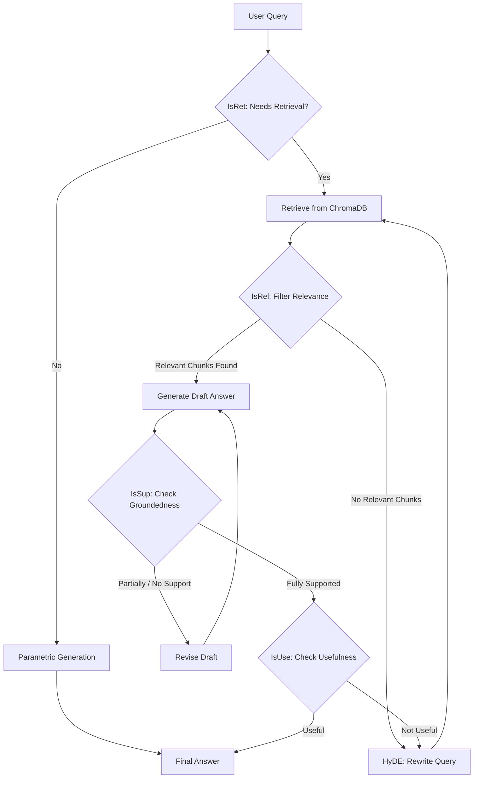

# Self-Reflective RAG (Self-RAG)

This project implements a **Self-Reflective Retrieval-Augmented Generation (Self-RAG)** architecture. Unlike standard RAG which blindly retrieves and generates, Self-RAG introduces a pure Python state machine where the LLM evaluates its own work at multiple checkpoints. If the model detects a hallucination, it rewrites its own answer. If it detects useless retrievals, it rewrites its own query using HyDE.

## 🧠 Architecture Overview

The pipeline utilizes **Dual Gemini Models** (`gemini-3.1-flash-lite` for fast classification and `gemini-1.5-pro` for accuracy-critical generation) enforced strictly by **Pydantic Structured Outputs** via the official `google-genai` SDK.

### The 5 Reflection Gates

1. **[IsRet] Retrieval Decision**: Does the user's query actually require searching the database? (e.g. "What is 2+2" bypasses retrieval entirely).
2. **[IsRel] Relevance Filter (Parallel)**: Analyzes the top retrieved chunks concurrently and scores them 1-5. Chunks scoring under 3 are dropped.
3. **[IsSup] Groundedness Check**: Once a draft is generated, the model acts as a strict fact-checker. It assigns a status: `FULLY_SUPPORTED`, `PARTIALLY_SUPPORTED`, or `NO_SUPPORT`.
4. **[Revise] Hallucination Correction Loop**: If `IsSup` finds unsupported claims, the draft is sent back to the generator with specific instructions to remove the fabricated claims. (Loops up to 3 times).
5. **[IsUse] Usefulness & Query Rewrite (HyDE)**: If the final grounded answer doesn't actually answer the user's question, it uses **HyDE** (Hypothetical Document Embeddings) to write a hypothetical ideal answer, embeds that, and triggers a totally new retrieval loop.

### Flowchart



---

## 🛠️ Tech Stack
*   **LLMs & Embeddings**: `google-genai` (Gemini 3.1 Flash Lite, Gemini 1.5 Pro, and `gemini-embedding-001` with 768D truncation).
*   **Vector Store**: `chromadb` (Persistent local storage using Cosine Similarity).
*   **Data Parsing**: `docling` (Table and layout-aware parsing for PDFs, DOCX, HTML).
*   **Orchestration**: Pure Python state machine with `asyncio` parallel evaluation.
*   **Structured Outputs**: `Pydantic` models natively passed into `response_schema`.
*   **CLI & UI**: `Typer` and `Rich` for beautiful, streaming terminal interfaces.

---

## 🚀 Setup & Installation

1. Add your documents to the `data/` directory.
2. Configure your API key in the `.env` file:
   ```env
   GEMINI_API_KEY="your_google_ai_studio_key"
   ```
3. Install dependencies:
   ```bash
   pip install -r requirements.txt
   ```
   *(Note: The codebase was temporarily patched to use standard Python `logging` and native dictionaries to avoid local `pip` hang issues, but `docling` and `chromadb` are required).*

---

## 💻 Usage (CLI Commands)

The project features a beautiful Typer CLI that prints the AI's "inner monologue" as it thinks.

### 1. Ingest Documents
Parse your PDFs using Docling, chunk them recursively, and upsert them to ChromaDB.
```bash
python main.py ingest
```

### 2. Query the System
Ask a question and watch the reflection gates execute in real-time.
```bash
python main.py query "Who is Rajkumar Pawar and what are his skills?"
```
**Tip:** Add the `-v` or `--verbose` flag to see the exact JSON trace of the reflection tokens!
```bash
python main.py query "Who is Rajkumar Pawar?" -v
```

### 3. Run the Evaluation Harness
Run a batch JSONL file containing `{"question": "...", "expected_answer": "..."}` pairs to test the hallucination rate, relevance precision, and latency of your configuration.
```bash
python main.py eval test_cases.jsonl
```

### 4. Database Stats
Check how many chunks are currently indexed in ChromaDB.
```bash
python main.py stats
```

---

## ⚙️ Configuration Tuning
You can tweak the thresholds, chunk sizes, and maximum loop limits inside `config.py`.

*   `CHUNK_SIZE`: 800
*   `CHUNK_OVERLAP`: 150
*   `RELEVANCE_THRESHOLD`: 3 (Out of 5)
*   `USEFULNESS_THRESHOLD`: 3 (Out of 5)
*   `MAX_REVISIONS`: 3
*   `MAX_RETRIEVAL_LOOPS`: 2
